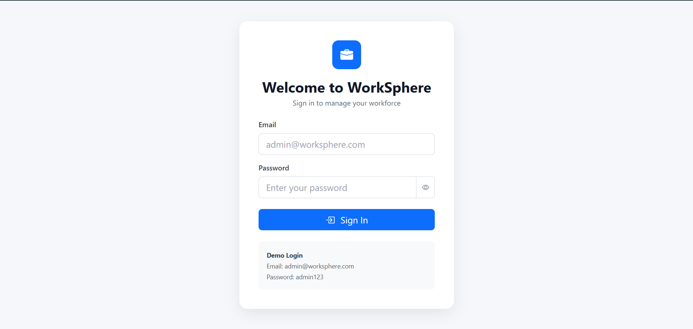
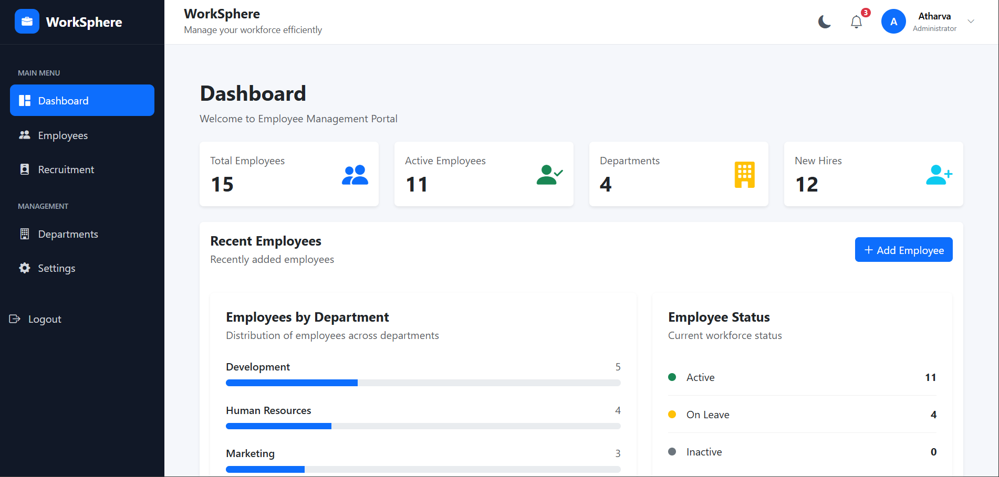
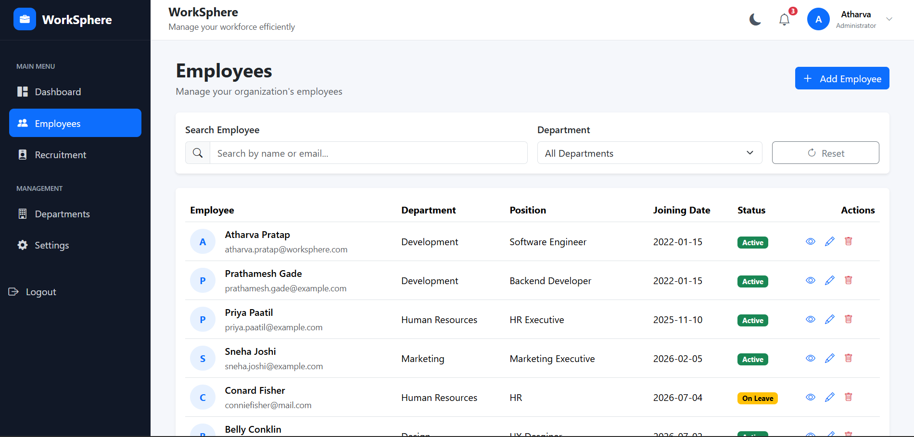
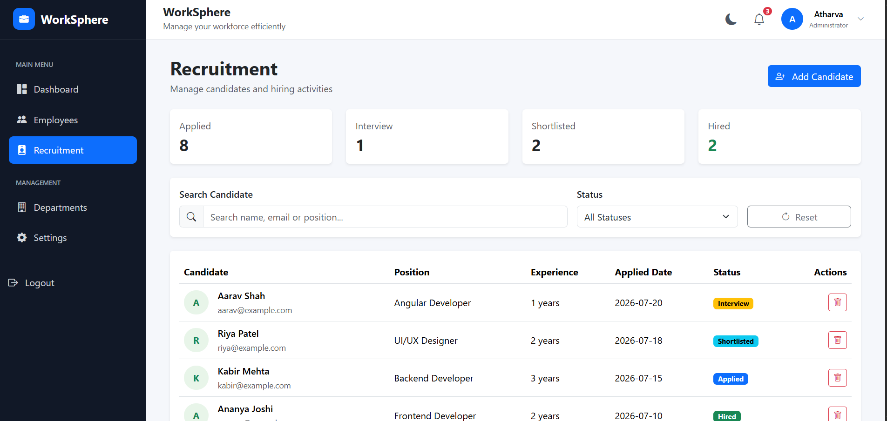
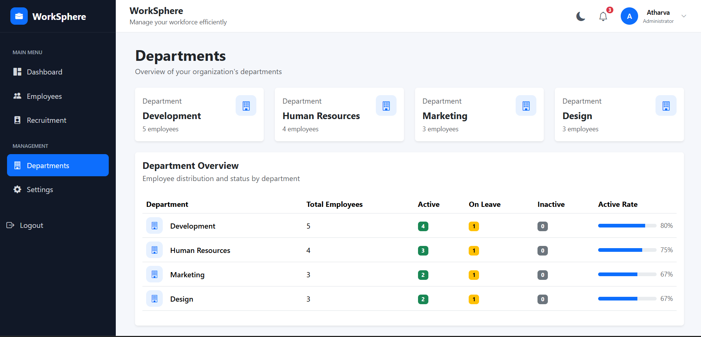
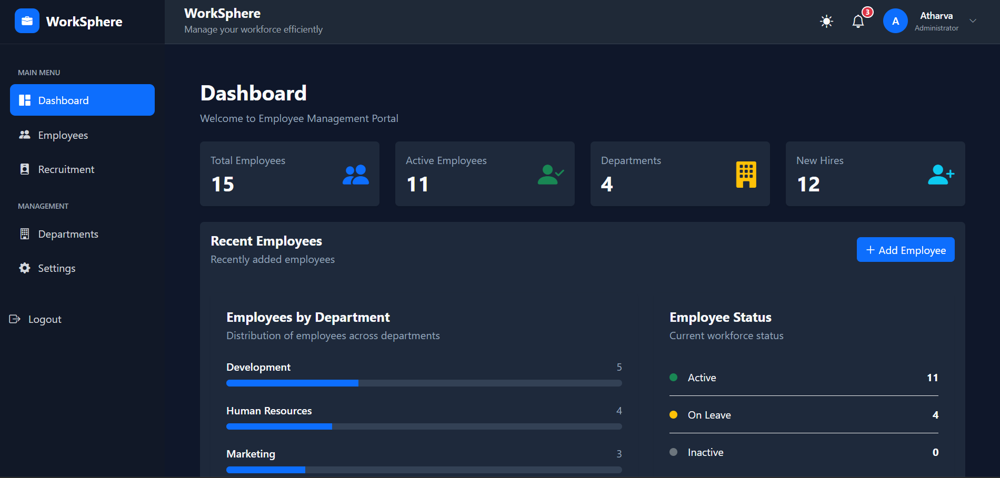
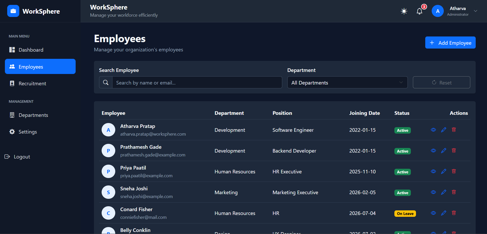
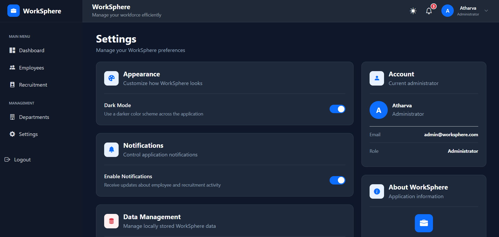

# WorkSphere

## Employee & Recruitment Management Portal

WorkSphere is a responsive Employee and Recruitment Management Portal built with Angular. It provides a centralized interface for managing employees, recruitment candidates, departments, workforce statistics, notifications, and application preferences.

The application includes authentication, real-time notifications, LocalStorage persistence, responsive layouts, and light/dark theme support.

---

## 🌐 Live Demo

**Live Application:**  
https://atharvapratap12.github.io/worksphere/

**GitHub Repository:**  
https://github.com/AtharvaPratap12/worksphere

### Demo Login

```text
Email: admin@worksphere.com
Password: admin123
```

> WorkSphere currently uses browser LocalStorage for application data, so the demo does not require a backend server.

---

## ✨ Features

### 📊 Dashboard

- Total employee statistics
- Active employee statistics
- Department count
- New hire statistics
- Employees by department
- Employee status distribution
- Dynamic dashboard data
- Recently added employee information

### 👥 Employee Management

- Add employees
- Edit employee information
- View employee details
- Delete employees
- Search employees by name or email
- Filter employees by department
- Employee status management
- LocalStorage persistence
- Employee activity notifications

### 💼 Recruitment Management

- Add candidates
- Delete candidates
- Search candidates by name, email, or position
- Filter candidates by recruitment status
- Recruitment statistics
- Candidate experience tracking
- Application date tracking
- Recruitment pipeline management
- Candidate activity notifications

### 🔔 Notifications

- Employee activity notifications
- Recruitment activity notifications
- Real-time unread notification count
- Mark all notifications as read
- Notification persistence
- Enable/disable notifications
- Instant notification badge updates

### ⚙️ Settings

- Light/Dark mode
- Notification preferences
- Local data management
- Administrator information
- Application information

### 🔐 Authentication

- Login system
- Protected application routes
- Authentication guard
- Logout functionality
- Demo administrator account

### 🎨 UI & UX

- Responsive design
- Desktop, tablet, and mobile layouts
- Bootstrap components
- Bootstrap Icons
- Interactive employee and candidate modals
- Responsive tables
- Search and filtering interfaces
- Light/Dark theme support
- Custom application favicon

---

## 🖼️ Screenshots

### 🔐 Login



### 📊 Dashboard



### 👥 Employee Management



### 💼 Recruitment



### 🏢 Departments



---

## 🌙 Dark Mode

### 📊 Dashboard



### 👥 Employees



### ⚙️ Settings


---

## 🛠️ Tech Stack

| Technology | Purpose |
|---|---|
| Angular 22 | Frontend framework |
| TypeScript | Application logic |
| HTML5 | Application structure |
| CSS3 | Styling and responsive design |
| Bootstrap | UI components and layout |
| Bootstrap Icons | Interface icons |
| Angular Router | Application navigation |
| Reactive Forms | Employee and login forms |
| Template-driven Forms | Recruitment forms |
| RxJS | Reactive notification updates |
| LocalStorage | Client-side persistence |
| GitHub Actions | Automated deployment |
| GitHub Pages | Production hosting |

---

## 🏗️ Project Structure

```text
src/
└── app/
    ├── authguard/
    │   └── auth.guard.ts
    │
    ├── layout/
    │   ├── layout.html
    │   ├── layout.css
    │   └── layout.ts
    │
    ├── models/
    │   ├── employee.ts
    │   └── candidate.ts
    │
    ├── pages/
    │   ├── dashboard/
    │   ├── employees/
    │   ├── add-employee/
    │   ├── recruitment/
    │   ├── departments/
    │   ├── setting/
    │   └── login/
    │
    └── services/
        ├── auth.ts
        ├── employee.ts
        ├── candidate.ts
        ├── notification.ts
        └── theme.ts
```

---

## 💾 Data Persistence

WorkSphere uses browser LocalStorage to store:

- Employees
- Recruitment candidates
- Notifications
- Notification preferences
- Theme preferences
- Authentication state

No backend server is required for the current version.

---

## 🚀 Getting Started

### Prerequisites

Make sure you have installed:

- Node.js
- npm
- Angular CLI

### 1. Clone the Repository

```bash
git clone https://github.com/AtharvaPratap12/worksphere.git
```

### 2. Navigate to the Project

```bash
cd worksphere
```

### 3. Install Dependencies

```bash
npm install
```

### 4. Start the Development Server

```bash
ng serve
```

Open the application at:

```text
http://localhost:4200
```

---

## 📦 Production Build

Create a production build with:

```bash
ng build
```

The production files are generated inside the `dist/` directory.

---

## 🔄 Deployment

WorkSphere is deployed using **GitHub Actions** and **GitHub Pages**.

Every push to the `main` branch automatically triggers the production deployment workflow.

```text
Git Push
   ↓
GitHub Actions
   ↓
Angular Production Build
   ↓
GitHub Pages Deployment
   ↓
Live WorkSphere Application
```

---

## 📱 Responsive Design

WorkSphere is designed to work across:

- Desktop
- Laptop
- Tablet
- Mobile devices

The dashboard, tables, forms, navigation, and modals adapt to different screen sizes.

---

## 🔮 Future Improvements

Possible future enhancements include:

- Backend API integration
- Database integration
- Role-based access control
- Multiple administrator accounts
- Employee profile photos
- Interview scheduling
- Advanced recruitment pipeline
- Email notifications
- Attendance management
- Payroll management
- PDF/Excel report exports
- Cloud-based data synchronization

---

## 📌 Project Status

**Production Ready — Version 1**

WorkSphere currently includes:

- Employee management
- Recruitment management
- Dashboard analytics
- Notifications
- Authentication
- Settings
- Responsive UI
- Dark mode
- Automated GitHub Pages deployment

---

## 👨‍💻 Author

**Atharva Pratap**

GitHub:  
https://github.com/AtharvaPratap12

---

## 📄 License

This project was created for educational and portfolio purposes.